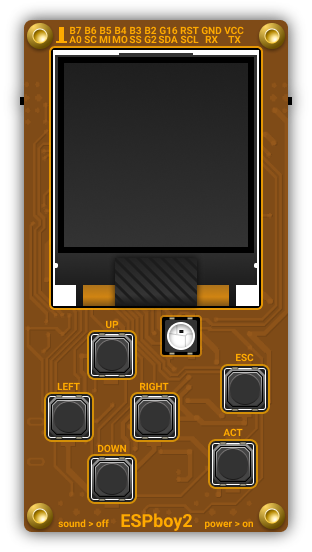
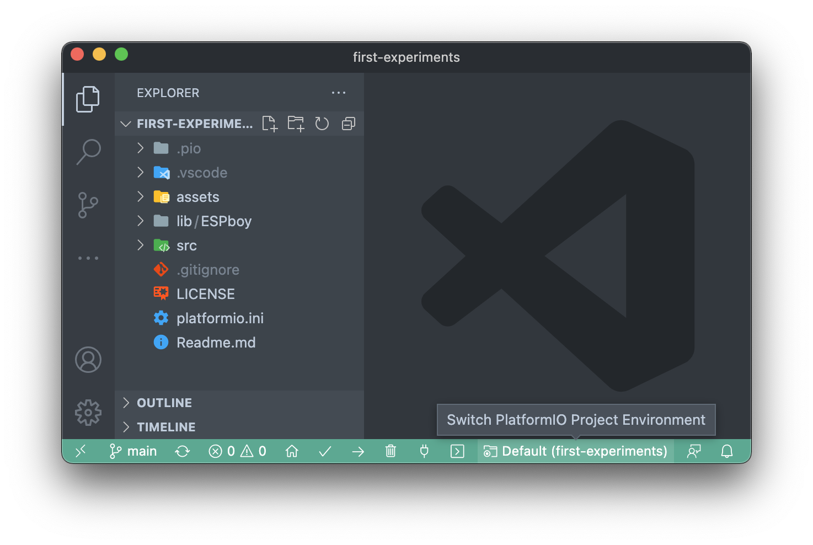

# My First Experiments with ESPboy2

This project gathers my first programming experiences with the [ESPboy2][espboy], designed by Roman Sokolov. My code is at your disposal to help you get your feet wet and start your adventure with this endearing tiny handheld, in the STEAM spirit.

However, note that this project is experimental and therefore is likely to evolve frequently. The code can be modified at any time and reworked in-depth as I experiment.

At the stage where I am today, I use the following libraries to simplify the use of the various peripherals of the microcontroller:

- [Adafruit MCP23017 Arduino Library][mcp23017]
- [Adafruit MCP4725 Arduino Library][mcp4725]
- [LovyanGFX][lovyangfx]

I noticed that most of the developments around the ESPboy adopted Bodmer's [TFT_eSPI][tftespi] library, but I personally preferred to use the [LovyanGFX][lovyangfx] library, which provides impressive optimizations. Its author, lovyan03, has kindly agreed to [add support for ESP8266][lovyan8266] to make our life with ESPboy easier. You can thank him by starring :star: his library.

To factorize the initialization and interaction procedures with the handheld, I coded an embryonic `ESPboy` library that provides a primary controller and simplifies the writing of programs that rely on it. This library is likely to evolve over time.

The source code is organized as a [PlatformIO][platformio] project and is therefore built around the [`platformio.ini`][pioconfig] configuration file. The example applications are located in the `src` folder and correspond to separate environments in the `platformio.ini` configuration file. To test an application, you will need to switch to the appropriate one in PlatformIO:

## Run the applications on your ESPboy

You can try out the applications without compiling them by uploading the precompiled binaries to your ESPboy. To do this, you need to connect the handheld to your PC with a USB cable. Then [go to this page][binaries] with Google Chrome or Microsoft Edge.

[espboy]:     https://www.espboy.com/
[platformio]: https://platformio.org/
[mcp23017]:   https://github.com/adafruit/Adafruit-MCP23017-Arduino-Library
[mcp4725]:    https://github.com/adafruit/Adafruit_MCP4725
[lovyangfx]:  https://github.com/lovyan03/LovyanGFX
[tftespi]:    https://github.com/Bodmer/TFT_eSPI
[lovyan8266]: https://github.com/lovyan03/LovyanGFX/issues/130
[pioconfig]:  platformio.ini
[binaries]:   https://espboy.m1cr0lab.com/demo/first-experiments/